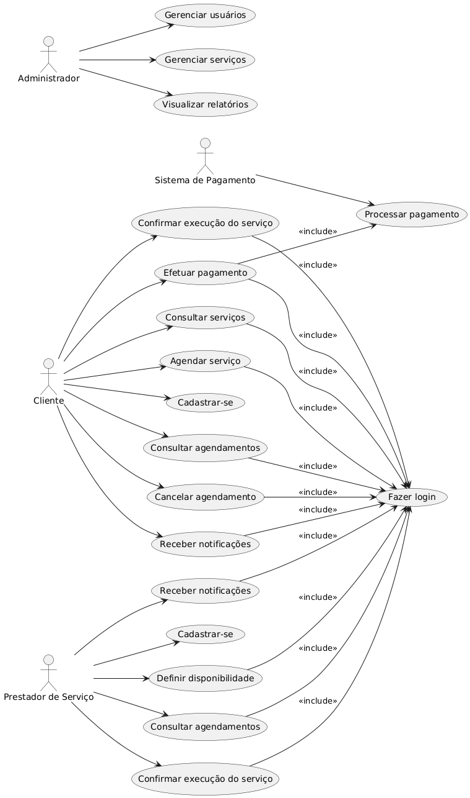

# Casos de Uso

## 📘 Agendar Serviço

### 🧑‍💼 Atores
- Cliente

### ✅ Pré-condições
- O cliente deve estar **cadastrado e logado** no sistema.
- Devem existir **serviços e prestadores disponíveis** no sistema.

### 🔄 Fluxo Principal
1. O cliente acessa a funcionalidade **"Agendar Serviço"**.
2. O sistema exibe uma **lista de serviços disponíveis**.
3. O cliente seleciona o tipo de serviço desejado.
4. O sistema exibe uma **lista de prestadores** que oferecem o serviço, com **avaliações e disponibilidade**.
5. O cliente seleciona um prestador específico.
6. O sistema exibe os **horários disponíveis** do prestador, respeitando:
    - Regra de **concorrência de serviços**
    - Definição de **disponibilidade do prestador**
7. O cliente seleciona a **data e hora** desejadas, respeitando a **regra de agendamento com 24h de antecedência**.
8. O sistema apresenta um **resumo do agendamento**:
    - Serviço
    - Prestador
    - Data e hora
    - Valor
9. O cliente **confirma o agendamento**.
10. O sistema registra o agendamento como:
    - **"Pendente de Confirmação"**, ou
    - **"Confirmado"**, se não houver etapa de confirmação do prestador.
11. O sistema **envia notificações**

### ⚠️ Fluxos Alternativos / Exceções

#### ⛔ Horário Indisponível
- Se o horário selecionado já tiver sido ocupado:
    - O sistema **informa o cliente**
    - Sugere **horários alternativos**

#### ❌ Cliente Cancela Agendamento
- O cliente desiste antes da confirmação.
- O sistema **cancela o processo** ou retorna à tela anterior.

### 📦 Pós-condições
- Um novo **agendamento é registrado** no sistema com status:
    - "Pendente" ou "Confirmado"
- A **disponibilidade do prestador é atualizada**
- **Notificações** são enviadas para cliente e prestador

## Cancelar Agendamento

### 🧑‍💼 Atores
- Cliente
- Prestador de Serviço

### ✅ Pré-condições
- O cliente ou prestador deve estar **logado no sistema**.
- Deve existir um **agendamento ativo** para ser cancelado.

### 🔄 Fluxo Principal (Cliente)
1. O cliente acessa a funcionalidade de **consulta de agendamentos**.
2. O sistema exibe a **lista de agendamentos do cliente**.
3. O cliente seleciona o **agendamento que deseja cancelar**.
4. O sistema verifica se o cancelamento é permitido conforme a **regra de negócio de Prazo para Cancelamento**.
5. O sistema solicita ao cliente o **motivo do cancelamento**.
6. O cliente informa o motivo e **confirma o cancelamento**.
7. O sistema altera o status do agendamento para **"Cancelado"**.
8. O sistema **libera a disponibilidade** do prestador para o horário cancelado.
9. O sistema **envia notificações** ao cliente e ao prestador.
10. Se o agendamento já foi pago, o sistema **inicia o processo de reembolso**, conforme a regra de **Reembolso por Cancelamento**.

### 🔄 Fluxo Principal (Prestador)
1. O prestador acessa a funcionalidade de **consulta de agendamentos**.
2. O sistema exibe a **lista de agendamentos do prestador**.
3. O prestador seleciona o **agendamento que deseja cancelar**.
4. O sistema verifica se o cancelamento é permitido conforme a **regra de negócio de Prazo para Cancelamento**.
5. O sistema solicita ao prestador o **motivo do cancelamento**.
6. O prestador informa o motivo e **confirma o cancelamento**.
7. O sistema altera o status do agendamento para **"Cancelado"**.
8. O sistema **libera a disponibilidade** para o horário cancelado.
9. O sistema **envia notificações** ao cliente e ao prestador.
10. Se o agendamento já foi pago, o sistema **notifica o cliente sobre o reembolso**, conforme a regra de **Reembolso por Cancelamento**.

### ⚠️ Fluxos Alternativos / Exceções

#### ⏳ Prazo de Cancelamento Expirado
- Se o cliente ou prestador tentar cancelar **fora do prazo permitido**, o sistema:
    - Informa que o cancelamento **não é mais possível**
    - Sugere **contato direto**, se aplicável

#### 📝 Falha ao Registrar Motivo
- Se o **motivo do cancelamento** não for informado:
    - O sistema **impede o cancelamento**
    - Solicita o preenchimento do campo obrigatório

### 📦 Pós-condições
- O status do agendamento é alterado para **"Cancelado"**.
- A **disponibilidade do prestador é restaurada**.
- **Notificações** de cancelamento são enviadas a ambos os envolvidos.
- Se aplicável, o **processo de reembolso** é iniciado.

## Fazer Login

### 👥 Atores
- Administrador
- Cliente
- Prestador de Serviço

### ✅ Pré-condições
- O usuário deve possuir uma **conta cadastrada no sistema**.

### 🔄 Fluxo Principal
1. O usuário acessa a **página de login** do sistema.
2. O sistema exibe os **campos para e-mail/usuário e senha**.
3. O usuário insere suas **credenciais**.
4. O usuário clica no botão **"Entrar"**.
5. O sistema **valida as credenciais** informadas.
6. Se forem válidas, o sistema **redireciona o usuário para sua página inicial (dashboard)** correspondente ao seu perfil:
    - Administrador
    - Cliente
    - Prestador de Serviço

### ⚠️ Fluxos Alternativos / Exceções

#### ❌ Credenciais Inválidas
- Se o e-mail/usuário ou senha estiverem incorretos:
    - O sistema exibe a mensagem:  
      **"Credenciais inválidas. Tente novamente."**
    - O sistema permite nova tentativa de login.

#### 🔒 Conta Bloqueada
- Se a conta estiver bloqueada (por tentativas falhas ou por ação do administrador):
    - O sistema informa que a conta está bloqueada.
    - Pode solicitar que o usuário **entre em contato com o suporte**.

### 📦 Pós-condições
- O usuário é **autenticado no sistema**.
- Tem acesso às **funcionalidades de seu perfil** (Administrador, Cliente ou Prestador).

